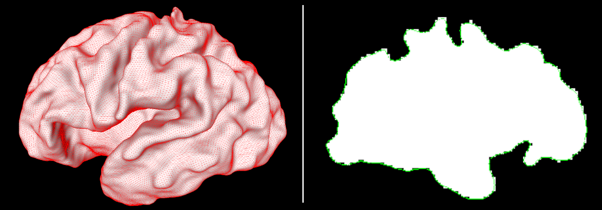

# Fetal CP Surface Extraction

[](https://hub.docker.com/r/fnndsc/pl-fetal-cp-surface-extract)
[](https://github.com/FNNDSC/pl-fetal-cp-surface-extract/blob/main/LICENSE)
[](https://github.com/FNNDSC/pl-fetal-cp-surface-extract/actions/workflows/ci.yml)

Fetal brain cortical plate surface extraction using CIVET marching-cubes (`sphere_mesh`).



## Abstract

`pl-fetal-cp-surface-extract` consumes binary volumetric `.mnc` brain masks to produce
surfaces as `.obj` files with standard connectivity (81,920 triangles). This program is
suitable for targeting the **inner cortical plate** surface (gray-white matter boundary)
of high-quality human fetal brain MRI segmentation for subjects between 23-35 gestational
weeks of age.

## Background

Polygonal surface mesh representations of brain hemispheres are useful for measuring cortical
thickness, image registration, and quantitative regional analysis.

## Surface Extraction Algorithm

1. Proprocess mask using `mincmorph` to fill in disconnected voxels (improve mask quality)
2. Marching-cubes -> spherical topology surface mesh with unknown number of triangles
3. Sphere-to-sphere interpolation -> resample mesh to standard connectivity of 81,920 triangles, preserving morphology

## Installation

`pl-fetal-cp-surface-extract` is a _[ChRIS](https://chrisproject.org/) plugin_, meaning it can
run from either within _ChRIS_ or the command-line.

[](https://chrisstore.co/plugin/pl-fetal-cp-surface-extract)

## Usage

`extract_cp` reads mask files from an input directory and creates
the resulting surface files in an output directory.

### Input

Input files should be MINC `.mnc` files representing a mask of the white matter (WM)
for a single brain hemisphere (either left or right). WM should be indicated by a
value of `1`, background value should be `0`.

If the input directory contains multiple masks, they will all be processed
individually and in parallel.

### Options

#### `--mincmorph-iterations`

Number of `mincmorph` iterations to perform on the mask before marching-cubes.
Use a larger value as a workaround for masks which have missing voxels. However,
extremely bad masks will require external correction, for instance, using `mincdefrag`.
_Garbage in, garbage out_.

```shell
extract_cp --mincmorph-iterations 10 /incoming /outgoing
```

#### `--adapt_object_mesh`

Arguments to pass to `adapt_object_mesh`, which does mesh smoothing.
Use a larger value if the results are bumpy/voxelated in appearance.

```shell
extract_cp --adapt_object_mesh 1,100,1 /incoming /outgoing
```

#### `--inflate_to_sphere_implicit`

Arguments to pass to `inflate_to_sphere_implicit`. The default value `(200, 200)`
should work for fetal brains. While it shouldn't be necessary, increasing the
values shouldn't do any harm, and would help compensate for larger brain sizes.

## Local Usage

To get started with local command-line usage, use [Apptainer](https://apptainer.org/)
(a.k.a. Singularity) to run `pl-fetal-cp-surface-extract` as a container:

```shell
singularity exec docker://fnndsc/pl-fetal-cp-surface-extract extract_cp input/ output/
```

To print its available options, run:

```shell
singularity exec docker://fnndsc/pl-fetal-cp-surface-extract extract_cp --help
```

## Development

Instructions for developers.

### Building

Build a local container image:

```shell
docker build -t localhost/fnndsc/pl-fetal-cp-surface-extract .
```

### Get JSON Representation

Run [`chris_plugin_info`](https://github.com/FNNDSC/chris_plugin#usage)
to produce a JSON description of this plugin, which can be uploaded to a _ChRIS Store_.

```shell
docker run --rm localhost/fnndsc/pl-fetal-cp-surface-extract chris_plugin_info > chris_plugin_info.json
```

### Local Test Run

Mount the source code `extract_cp.py` into a container to test changes without rebuild.

```shell
docker run --rm -it --userns=host -u $(id -u):$(id -g) \
    -v $PWD/extract_cp:/opt/conda/lib/python3.10/site-packages/extract_cp:ro \
    -v $PWD/in:/incoming:ro -v $PWD/out:/outgoing:rw -w /outgoing \
    localhost/fnndsc/pl-fetal-cp-surface-extract extract_cp /incoming /outgoing
```

