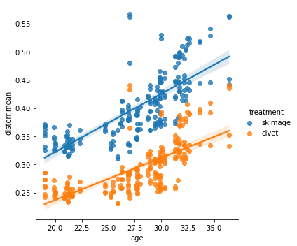
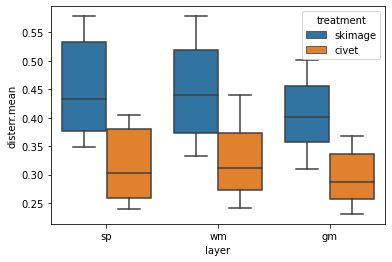

Brief comparison of marching-cubes implementations between
[scikit-image](https://github.com/FNNDSC/pl-fetal-surface-extract)
and [CIVET](https://github.com/FNNDSC/ep-sphere_mesh).

Cost function is mean
[surface-to-volume distance error](https://github.com/FNNDSC/pl-surfdisterr),
less is better.

Age in units of gestational weeks. Distance in mm.

